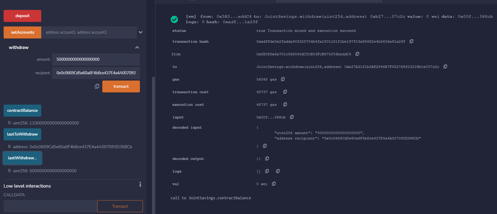
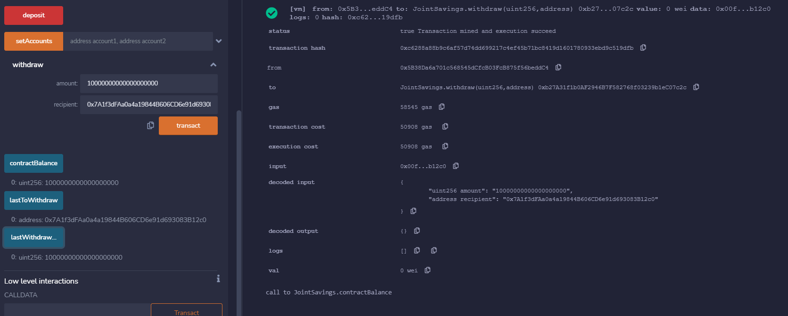

# Unit 20 - "Joint Savings Account"


### Background

A fintech startup company has recently hired me. This company is disrupting the finance industry with its own cross-border, Ethereum-compatible blockchain that connects financial institutions. Currently, the team is building smart contracts to automate many of the institutions’ financial processes and features, such as hosting joint savings accounts.

To automate the creation of joint savings accounts, I'll create a Solidity smart contract that accepts two user addresses. These addresses will be able to control a joint savings account. My smart contract will use ether management functions to implement a financial institution’s requirements for providing the features of the joint savings account. These features will consist of the ability to deposit and withdraw funds from the account.

### I will be Creating the following:

  * A solidity smart contrct file is created in [Start_Code](Starter_Code/joint_savings.sol).

  * A folder named `Execution_Results` will contains images of test results. 


### Instructions

The steps for this task are divided into the following sections:

1. Create a Joint Savings Account Contract in Solidity

2. Compile and Deploy Your Contract in the JavaScript VM

3. Interact with Your Deployed Smart Contract

#### Step 1: Create a Joint Savings Account Contract in Solidity

   * Define the following variables are defined in the JointSavings contract:
     

   * Following changes are made to function named `withdraw`
       1. Require statement to checks if `recipient` is one of accountOne or accountTwo
          `require(recipient == accountOne || recipient == accountTwo, "You don't own this account!");` </br></br>

       2. Require statement to make sure enough funds are available to transact
          `require(amount <= address(this).balance, "Insufficient funds!");` </br></br>

       3. Set `lastToWithdraw` is equal to `recipient`
          `if (lastToWithdraw != recipient){`
          `  lastToWithdraw = recipient;}`</br></br>

       4. Set `recipient` transfer `amount`
          `recipient.transfer(amount);`</br></br>

       5. Set `lastWithdrawAmount` equal to `amount`
          `lastWithdrawAmount = amount;`</br></br>

       6. Set `contractBalance` to `address(this).balance`
          `contractBalance = address(this).balance;`</br></br>


    * Following changes are made to function named `payable`
      1. Set the `contractBalance` variable equal to the balance of the contract by using `address(this).balance`
         `contractBalance = address(this).balance;`</br></br>

    * Changes to function named `setAccounts`
      1. set the values of `accountOne` and `accountTwo` to `account1` and `account2`, respectively
         `accountOne = account1;`
         `accountTwo = account2;`</br></br>

    * Add a fallback function so that your contract can store ether that’s sent from outside the deposit function.
      'unction() external payable {}`


#### Step 2: Compile and Deploy Your Contract in the JavaScript VM

   1. Compile your smart contract. If an error occurs, review your code, and make the necessary changes for a successful compilation.
      

   2. In the Remix IDE, navigate to the “Deploy & Run Transactions” pane, and then make sure that “JavaScript VM” is selected as the environment.
      

   3. Click the Deploy button to deploy your smart contract, and then confirm that it successfully deployed.
      


</br>
#### Step 3: Interact with Your Deployed Smart Contract

   1. Set to use authorized Ethereum address using function `setAccounts`
      [](Execution_Results/Set_Account_Address.png)

        > ```text
        >  account1 address: 0x0c0669Cd5e60a6F4b8ce437E4a4A007093D368Cb
        >  account2 address: 0x7A1f3dFAa0a4a19844B606CD6e91d693083B12c0
        > ```

    2. Testing deposit functionality

        * Transaction 1: Send 1 ether as wei.
          
          

        * Transaction 2: Send 10 ether as wei.
          
                  

        * Transaction 3: Send 5 ether.
          
                  


    3. Testing withdrawel function
       
       
---

